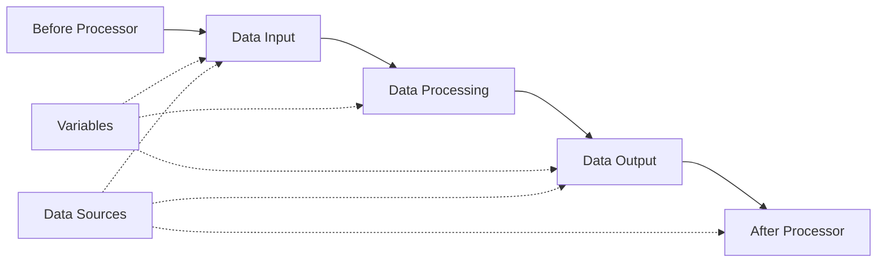

# Creating Tasks

Tasks are the core functional units in ETL-GO, used to define complete data processing workflows. A task contains multiple components including data input, data processing, data output, and can be executed on schedule or triggered manually.

## Task Components

A complete ETL task typically consists of the following components:



### 1. Before Processor (Before Execute)
Components executed before data input, typically used for:
- Data preprocessing
- Environment checks
- Resource preparation

### 2. Data Input (Source)
Components that extract data from data sources, supporting:
- SQL queries (MySQL/PostgreSQL/SQLite)
- CSV files
- JSON files

### 3. Data Processing (Processor)
Components that transform and process input data, supporting:
- Data type conversion (convertType)
- Row filtering (filterRows)
- Data masking (maskData)
- Column renaming (renameColumn)
- Column selection (selectColumns)

### 4. Data Output (Sink)
Components that write processed data to target locations, supporting:
- SQL tables (MySQL/PostgreSQL/SQLite)
- CSV files
- JSON files
- Doris fast output (stream_load)

### 5. After Processor (After Execute)
Components executed after data output, typically used for:
- Data cleanup
- Result verification
- Notification sending

## Creating New Tasks

### Creating via Web Interface

1. **Log in to ETL-GO Web Interface**
   Visit `http://localhost:8081`, login with default credentials:
   - Username: `admin`
   - Password: `password123`

2. **Enter Task Management**
   Click "Task Management" in the left navigation bar, then click the "New Task" button.

3. **Fill in Basic Information**
   ```yaml
   Task Name: User Data Sync      # Unique identifier for the task
   Scheduling Mode:
     - manual: Manual trigger
     - cron expression: Scheduled execution (e.g., "0 0 * * *" means daily at 00:00)
   ```

4. **Configure Task Components**
   Configure each component in the following order:

#### Step 1: Configure Before Processor (Optional)
```yaml
Type: sql                # Currently only supports SQL executor
Data Source: Production MySQL Database      # Select configured data source
Parameters:
  - key: sql
    value: |
      -- Clean up temporary tables
      DROP TABLE IF EXISTS temp_users;
      
      -- Create temporary table
      CREATE TABLE temp_users (
        id INT PRIMARY KEY,
        name VARCHAR(100),
        created_at DATETIME
      );
```

#### Step 2: Configure Data Input
```yaml
Type: sql                # Supports sql/csv/json
Data Source: Production MySQL Database      # Select data source
Parameters:
  - key: sql
    value: |
      SELECT 
        id,
        name,
        email,
        created_at,
        updated_at
      FROM users
      WHERE status = 'active'
        AND created_at >= '{{开始日期}}'
```

#### Step 3: Configure Data Processing
Multiple processors can be added, executed in order:

**Example 1: Data Type Conversion**
```yaml
Type: convertType
Parameters:
  - key: columns
    value: |
      [
        {"column": "id", "type": "string"},
        {"column": "created_at", "type": "datetime"}
      ]
```

**Example 2: Data Masking**
```yaml
Type: maskData
Parameters:
  - key: columns
    value: |
      [
        {"column": "email", "algorithm": "md5"}
      ]
```

**Example 3: Column Selection**
```yaml
Type: selectColumns
Parameters:
  - key: columns
    value: "id,name,email,created_at"
```

#### Step 4: Configure Data Output
```yaml
Type: sql                # Supports sql/csv/json/doris
Data Source: Backup MySQL Database      # Select target data source
Parameters:
  - key: table
    value: "users_backup"
  - key: mode
    value: "upsert"     # upsert: insert or update
  - key: key_columns
    value: "id"
```

#### Step 5: Configure After Processor (Optional)
```yaml
Type: sql
Data Source: Log Database
Parameters:
  - key: sql
    value: |
      -- Record task execution log
      INSERT INTO task_logs 
      (task_name, status, record_count, execution_time)
      VALUES ('用户数据同步', 'success', {{记录数}}, NOW());
```

## Task Configuration Examples

### Example 1: Daily Data Backup Task
```yaml
任务名称: daily_user_backup
调度方式: 0 2 * * *  # Execute daily at 02:00 AM
描述: Daily backup of user data

配置:
  数据输入:
    类型: sql
    数据源: prod_mysql
    参数:
      - key: sql
        value: |
          SELECT * FROM users
          WHERE updated_at >= DATE_SUB(CURDATE(), INTERVAL 1 DAY)

  数据处理:
    - 类型: selectColumns
      参数:
        - key: columns
          value: "id,name,email,phone,created_at,updated_at"

    - 类型: maskData
      参数:
        - key: columns
          value: |
            [
              {"column": "phone", "algorithm": "mask", "show_first": 3, "show_last": 4}
            ]

  数据输出:
    类型: sql
    数据源: backup_mysql
    参数:
      - key: table
        value: "users_backup_{{日期}}"
      - key: mode
        value: "replace"
```

### Example 2: Real-time Log Analysis Task
```yaml
任务名称: log_analysis_5min
调度方式: */5 * * * *  # Execute every 5 minutes
描述: Analyze application logs every 5 minutes

配置:
  数据输入:
    类型: sql
    数据源: log_mysql
    参数:
      - key: sql
        value: |
          SELECT 
            service,
            level,
            COUNT(*) as count,
            AVG(response_time) as avg_response
          FROM app_logs
          WHERE log_time >= DATE_SUB(NOW(), INTERVAL 5 MINUTE)
          GROUP BY service, level

  数据处理:
    - 类型: convertType
      参数:
        - key: columns
          value: |
            [
              {"column": "count", "type": "integer"},
              {"column": "avg_response", "type": "float"}
            ]

  数据输出:
    类型: csv
    参数:
      - key: file_path
        value: "/logs/analysis/report_{{时间戳}}.csv"
      - key: include_header
        value: "true"

  后置处理器:
    类型: sql
    数据源: alert_mysql
    参数:
      - key: sql
        value: |
          -- Send alert if error count too high
          INSERT INTO alerts (type, level, message)
          SELECT 
            'error_rate_high',
            'warning',
            CONCAT('Service ', service, ' has ', count, ' errors in last 5 minutes')
          FROM {{input_data}}
          WHERE level = 'ERROR' AND count > 10
```

### Example 3: Cross-database Data Synchronization Task
```yaml
任务名称: order_sync_pg_to_mysql
调度方式: manual  # Manual trigger only
描述: Synchronize orders from PostgreSQL to MySQL

配置:
  前置处理器:
    类型: sql
    数据源: target_mysql
    参数:
      - key: sql
        value: |
          -- Create sync lock
          CREATE TABLE IF NOT EXISTS sync_lock (
            task_name VARCHAR(100) PRIMARY KEY,
            locked BOOLEAN DEFAULT FALSE,
            lock_time DATETIME
          );
          
          -- Try to acquire lock
          INSERT INTO sync_lock (task_name, locked, lock_time)
          VALUES ('order_sync_pg_to_mysql', TRUE, NOW())
          ON DUPLICATE KEY UPDATE 
            locked = IF(locked = FALSE, TRUE, locked),
            lock_time = NOW();

  数据输入:
    类型: sql
    数据源: source_postgres
    参数:
      - key: sql
        value: |
          SELECT 
            order_id,
            customer_id,
            amount,
            order_date,
            status
          FROM orders
          WHERE updated_at > '{{上次同步时间}}'
          ORDER BY order_id
          LIMIT 1000

  数据输出:
    类型: sql
    数据源: target_mysql
    参数:
      - key: table
        value: "orders"
      - key: mode
        value: "upsert"
      - key: key_columns
        value: "order_id"
      - key: batch_size
        value: "100"

  后置处理器:
    类型: sql
    数据源: target_mysql
    参数:
      - key: sql
        value: |
          -- Update sync timestamp
          INSERT INTO sync_config (key, value)
          VALUES ('last_sync_time_order', NOW())
          ON DUPLICATE KEY UPDATE value = NOW();
          
          -- Release lock
          UPDATE sync_lock 
          SET locked = FALSE 
          WHERE task_name = 'order_sync_pg_to_mysql';
```

## Task Scheduling

### Cron Expression Syntax
```yaml
# Minute Hour Day Month Weekday
# * * * * *
# │ │ │ │ │
# │ │ │ │ └─── Day of week (0-7, 0 and 7 both represent Sunday)
# │ │ │ └───── Month (1-12)
# │ │ └─────── Day of month (1-31)
# │ └───────── Hour (0-23)
# └─────────── Minute (0-59)
```

### Common Scheduling Examples
```yaml
# Every minute
调度方式: "* * * * *"

# Every hour at minute 0
调度方式: "0 * * * *"

# Daily at 2:30 AM
调度方式: "30 2 * * *"

# Weekly (Monday at 1:00 AM)
调度方式: "0 1 * * 1"

# Monthly (1st day at 3:00 AM)
调度方式: "0 3 1 * *"

# Every 5 minutes
调度方式: "*/5 * * * *"

# Weekdays (Monday-Friday) at 9:00 AM
调度方式: "0 9 * * 1-5"

# Weekends at 10:00 AM
调度方式: "0 10 * * 6,7"
```

## Task Variables

### Using Variables in Tasks
Variables can be referenced anywhere in task configuration:

```yaml
# Reference in SQL queries
SELECT * FROM table WHERE date = '{{日期变量}}'

# Reference in file paths
file_path: "/exports/{{业务名称}}_{{日期}}.csv"

# Reference in conditions
filter_condition: "age > {{最小年龄}}"
```

### Special Variables
System-provided special variables:

```yaml
# Current timestamp
{{timestamp}}          # Current timestamp (e.g., 20240101_120000)
{{date}}              # Current date (e.g., 2024-01-01)
{{time}}              # Current time (e.g., 12:00:00)

# Task information
{{task_name}}         # Current task name
{{task_id}}           # Current task ID
{{execution_id}}      # Current execution ID
```

## Error Handling

### Task Failure Strategies
```yaml
error_strategy:
  max_retries: 3       # Maximum retry attempts
  retry_interval: 300  # Retry interval (seconds)
  on_failure:          # Action on final failure
    - action: email    # Send email notification
      recipients: admin@example.com
    - action: log      # Log failure details
      level: error
```

### Component Error Handling
```yaml
components:
  数据输入:
    on_error: skip     # skip: Skip this component, continue: Continue anyway, fail: Fail task
    
  数据处理:
    on_error: continue
    
  数据输出:
    on_error: fail     # Critical component, fail on error
```

## Performance Optimization

### 1. Batch Processing
```yaml
batch_config:
  size: 1000           # Records per batch
  timeout: 30s         # Batch timeout
  workers: 4           # Number of parallel workers
```

### 2. Memory Management
```yaml
memory_config:
  max_heap_mb: 1024    # Maximum heap memory (MB)
  spill_to_disk: true  # Spill to disk when memory full
  temp_dir: /tmp/etl   # Temporary directory
```

### 3. Database Optimization
```yaml
database_config:
  fetch_size: 1000     # Database fetch size
  query_timeout: 300s  # Query timeout
  connection_pool: 10  # Connection pool size
```

## Monitoring and Logging

### Task Execution Logs
```yaml
logging:
  level: info          # debug, info, warn, error
  file: /logs/tasks/{{task_name}}.log
  rotation:
    max_size: 100MB    # Maximum log file size
    max_files: 10      # Maximum log files to keep
```

### Performance Metrics
```yaml
metrics:
  enabled: true
  interval: 60s        # Metrics collection interval
  exporters:
    - type: prometheus # Export to Prometheus
      port: 9090
    - type: file       # Export to file
      path: /metrics/{{task_name}}.json
```

## API Reference

### Create Task
```http
POST /api/task
Content-Type: application/json

{
  "mission_name": "user_backup",
  "cron": "0 2 * * *",
  "params": {
    "before": {
      "type": "sql",
      "data_source": "datasource_mysql",
      "params": [
        {"key": "sql", "value": "DELETE FROM temp_users"}
      ]
    },
    "source": {
      "type": "sql",
      "data_source": "datasource_mysql",
      "params": [
        {"key": "sql", "value": "SELECT * FROM users WHERE status = 'active'"}
      ]
    },
    "processors": [
      {
        "type": "selectColumns",
        "params": [
          {"key": "columns", "value": "id,name,email"}
        ]
      }
    ],
    "sink": {
      "type": "sql",
      "data_source": "datasource_backup",
      "params": [
        {"key": "table", "value": "users_backup"},
        {"key": "mode", "value": "replace"}
      ]
    }
  }
}
```

### Execute Task Manually
```http
POST /api/task/execute
Content-Type: application/json

{
  "task_id": "task_123",
  "params": {
    "custom_param": "value"
  }
}
```

### Get Task Status
```http
GET /api/task/status
Content-Type: application/json

{
  "task_id": "task_123"
}
```

## Best Practices

### 1. Naming Conventions
- Use meaningful names: `daily_user_backup`, `realtime_log_analysis`
- Include environment: `prod_order_sync`, `dev_data_cleanup`
- Add frequency: `hourly_metrics`, `weekly_report`

### 2. Environment Configuration
- Use different configurations for different environments
- Store sensitive information in environment variables
- Use configuration files for complex settings

### 3. Testing Strategy
- Test with small datasets first
- Validate data quality after processing
- Implement comprehensive error handling

### 4. Maintenance Plan
- Regular review and optimization of task performance
- Update documentation when configurations change
- Monitor task execution logs

## Next Steps

After creating tasks, you can:
1. [View Task Execution Records](/task-record) - Monitor task execution status
2. [Analyze Task Logs](/task-log) - Troubleshoot task execution issues
3. [Configure Task Scheduling](/task-schedule) - Automate task execution
4. [Set Task Dependencies](/task-dependency) - Configure task execution dependencies