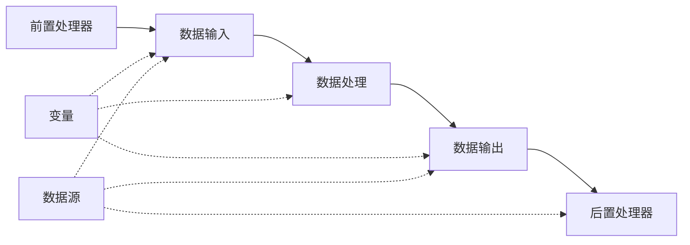

# 创建任务

任务是 ETL-GO 的核心功能单元，用于定义完整的数据处理流程。一个任务包含数据输入、数据处理、数据输出等多个组件，可以定时执行或手动触发。

## 任务组成

一个完整的 ETL 任务通常包含以下组件：



### 1. 前置处理器（Before Execute）
在数据输入之前执行的组件，通常用于：
- 数据预处理
- 环境检查
- 资源准备

### 2. 数据输入（Source）
从数据源提取数据的组件，支持：
- SQL 查询（MySQL/PostgreSQL/SQLite）
- CSV 文件
- JSON 文件

### 3. 数据处理（Processor）
对输入数据进行转换和处理的组件，支持：
- 数据类型转换（convertType）
- 行过滤（filterRows）
- 数据脱敏（maskData）
- 列重命名（renameColumn）
- 列选择（selectColumns）

### 4. 数据输出（Sink）
将处理后的数据写入目标位置的组件，支持：
- SQL 表（MySQL/PostgreSQL/SQLite）
- CSV 文件
- JSON 文件
- Doris 快速输出（stream_load）

### 5. 后置处理器（After Execute）
在数据输出之后执行的组件，通常用于：
- 数据清理
- 结果验证
- 通知发送

## 创建新任务

### 通过 Web 界面创建

1. **登录 ETL-GO Web 界面**
   访问 `http://localhost:8081`，使用默认账号登录：
   - 用户名：`admin`
   - 密码：`password123`

2. **进入任务管理**
   在左侧导航栏点击「任务管理」，然后点击「新建任务」按钮。

3. **填写基本信息**
   ```yaml
   任务名称: 用户数据同步      # 任务的唯一标识
   调度方式: 
     - manual: 手动触发
     - cron表达式: 定时执行（如 "0 0 * * *" 表示每天0点）
   ```

4. **配置任务组件**
   按照以下顺序配置各个组件：

#### 步骤1：配置前置处理器（可选）
```yaml
类型: sql                # 目前只支持 SQL 执行器
数据源: 生产MySQL数据库      # 选择已配置的数据源
参数:
  - key: sql
    value: |
      -- 清理临时表
      DROP TABLE IF EXISTS temp_users;
      
      -- 创建临时表
      CREATE TABLE temp_users (
        id INT PRIMARY KEY,
        name VARCHAR(100),
        created_at DATETIME
      );
```

#### 步骤2：配置数据输入
```yaml
类型: sql                # 支持 sql/csv/json
数据源: 生产MySQL数据库      # 选择数据源
参数:
  - key: sql
    value: |
      SELECT 
        id,
        name,
        email,
        created_at,
        updated_at
      FROM users
      WHERE status = 'active'
        AND created_at >= '{{开始日期}}'
```

#### 步骤3：配置数据处理
可以添加多个处理器，按顺序执行：

**示例1：数据类型转换**
```yaml
类型: convertType
参数:
  - key: columns
    value: |
      [
        {"column": "id", "type": "string"},
        {"column": "created_at", "type": "datetime"}
      ]
```

**示例2：数据脱敏**
```yaml
类型: maskData
参数:
  - key: columns
    value: |
      [
        {"column": "email", "algorithm": "md5"}
      ]
```

**示例3：列选择**
```yaml
类型: selectColumns
参数:
  - key: columns
    value: "id,name,email,created_at"
```

#### 步骤4：配置数据输出
```yaml
类型: sql                # 支持 sql/csv/json/doris
数据源: 备份MySQL数据库      # 选择目标数据源
参数:
  - key: table
    value: users_backup   # 目标表名
    
  - key: columns
    value: "id,name,email,created_at,updated_at"
    
  - key: mode
    value: "replace"      # 插入模式：insert/replace/update
```

#### 步骤5：配置后置处理器（可选）
```yaml
类型: sql
数据源: 生产MySQL数据库
参数:
  - key: sql
    value: |
      -- 更新同步记录
      UPDATE sync_log 
      SET last_sync_time = NOW(), 
          record_count = {{同步记录数}}
      WHERE table_name = 'users';
```

5. **保存任务**
   点击「保存」按钮，任务将进入「暂存」状态。

## 任务配置示例

### 示例1：简单的数据备份任务
```yaml
任务名称: 每日用户备份
调度方式: 0 2 * * *    # 每天凌晨2点执行

数据输入:
  类型: sql
  数据源: 生产数据库
  SQL: SELECT * FROM users WHERE status = 'active'

数据处理:
  - 类型: selectColumns
    参数: "id,name,email,created_at"
    
  - 类型: convertType
    参数: {"column": "created_at", "type": "datetime"}

数据输出:
  类型: sql
  数据源: 备份数据库
  表名: users_backup
  模式: insert
```

### 示例2：CSV 文件处理任务
```yaml
任务名称: 导入订单CSV
调度方式: manual        # 手动触发

数据输入:
  类型: csv
  参数:
    - key: file_path
      value: "/data/orders.csv"
    - key: has_header
      value: "true"

数据处理:
  - 类型: convertType
    参数: |
      [
        {"column": "order_id", "type": "integer"},
        {"column": "amount", "type": "decimal"},
        {"column": "order_date", "type": "date"}
      ]
    
  - 类型: filterRows
    参数: "amount > 100"   # 只处理金额大于100的订单

数据输出:
  类型: sql
  数据源: 分析数据库
  表名: order_summary
  模式: replace
```

### 示例3：使用变量的动态任务
```yaml
任务名称: 动态报表生成
调度方式: 0 8 * * *      # 每天上午8点执行

数据输入:
  类型: sql
  数据源: 报表数据库
  SQL: |
    SELECT 
      user_id,
      COUNT(*) as order_count,
      SUM(amount) as total_amount
    FROM orders
    WHERE order_date = '{{昨日日期}}'   # 使用变量
    GROUP BY user_id

数据处理:
  - 类型: renameColumn
    参数: |
      [
        {"old_name": "user_id", "new_name": "用户ID"},
        {"old_name": "order_count", "new_name": "订单数"},
        {"old_name": "total_amount", "new_name": "总金额"}
      ]

数据输出:
  类型: csv
  参数:
    - key: file_path
      value: "/reports/每日订单报表_{{昨日日期}}.csv"
    - key: include_header
      value: "true"
```

## 任务状态管理

### 任务状态说明
| 状态 | 说明 | 可执行操作 |
|------|------|------------|
| **暂存 (0)** | 任务已保存但未启动 | 编辑、删除、手动运行、启动调度 |
| **调度中 (1)** | 任务已加入调度器，将按计划执行 | 停止调度、手动运行 |
| **错误 (2)** | 任务执行失败 | 查看错误、编辑、重新启动 |

### 任务操作

#### 1. 手动运行任务
在任务列表点击「运行」按钮，任务将立即执行一次。

#### 2. 启动任务调度
在任务列表点击「启动」按钮，任务将按照配置的 Cron 表达式定时执行。

#### 3. 停止任务调度
在任务列表点击「停止」按钮，任务将停止定时执行，但可以手动运行。

#### 4. 编辑任务
点击「编辑」按钮可以修改任务配置。

**注意**：只有「暂存」状态的任务可以编辑。

#### 5. 删除任务
点击「删除」按钮可以删除任务。

**注意**：只有「暂存」状态的任务可以删除。

## 任务调试

### 1. 测试单个组件
在配置任务时，可以测试每个组件的配置是否正确：
- 数据输入：测试 SQL 查询或文件读取
- 数据处理：测试数据转换逻辑
- 数据输出：测试写入目标

### 2. 查看执行日志
任务执行后，可以查看详细日志：
1. 在任务列表点击任务名称
2. 切换到「执行记录」标签页
3. 查看每次执行的详细日志

### 3. 错误排查
如果任务执行失败：
1. 检查数据源连接是否正常
2. 验证 SQL 语法是否正确
3. 确认目标表结构是否匹配
4. 查看错误日志获取详细信息

## 最佳实践

### 1. 任务命名规范
建议使用有意义的任务名称：
- `daily_user_backup` - 每日用户备份
- `hourly_order_sync` - 每小时订单同步
- `monthly_report_generate` - 月度报表生成

### 2. 调度时间安排
- **数据处理任务**：安排在业务低峰期（如凌晨）
- **报表生成任务**：安排在需要报表的时间之前
- **实时同步任务**：使用较短的调度间隔

### 3. 错误处理策略
```yaml
# 在任务中添加错误处理
后置处理器:
  类型: sql
  SQL: |
    -- 记录错误信息
    INSERT INTO task_error_log 
    (task_name, error_time, error_message)
    VALUES ('{{任务名称}}', NOW(), '{{错误信息}}');
```

### 4. 性能优化
- **分批处理**：大数据量时分批处理，避免内存溢出
- **索引优化**：为查询字段添加索引
- **连接复用**：合理配置数据源连接池

## API 参考

### 创建任务
```http
POST /api/task
Content-Type: application/json

{
  "mission_name": "用户数据同步",
  "cron": "0 2 * * *",
  "params": {
    "before_execute": {
      "type": "sql",
      "data_source": "datasource_123",
      "params": [
        {"key": "sql", "value": "TRUNCATE TABLE temp_users;"}
      ]
    },
    "source": {
      "type": "sql",
      "data_source": "datasource_123",
      "params": [
        {"key": "sql", "value": "SELECT * FROM users;"}
      ]
    },
    "processors": [
      {
        "type": "selectColumns",
        "params": [
          {"key": "columns", "value": "id,name,email"}
        ]
      }
    ],
    "sink": {
      "type": "sql",
      "data_source": "datasource_456",
      "params": [
        {"key": "table", "value": "users_backup"},
        {"key": "columns", "value": "id,name,email"},
        {"key": "mode", "value": "insert"}
      ]
    }
  }
}
```

### 获取任务列表
```http
GET /api/task/list
```

### 手动运行任务
```http
POST /api/task/run-once
Content-Type: application/json

{
  "id": "task_123"
}
```

### 启动任务调度
```http
POST /api/task/run
Content-Type: application/json

{
  "id": "task_123"
}
```

### 停止任务调度
```http
POST /api/task/stop
Content-Type: application/json

{
  "id": "task_123"
}
```

## 下一步

创建好任务后，您可以：
1. [设置任务调度](/task-schedule) - 配置更复杂的执行计划
2. [查看任务执行情况](/task-record) - 监控任务执行状态
3. [分析任务日志](/task-log) - 排查问题和优化性能
4. [配置任务组件](/task-executor) - 了解各个组件的详细配置